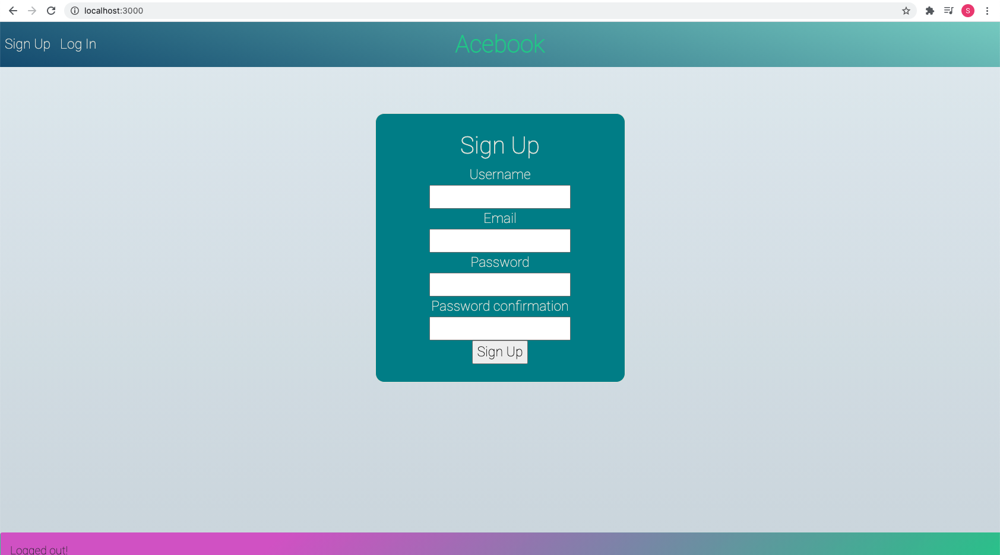
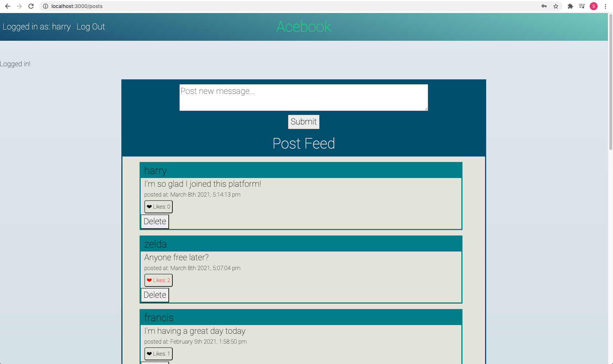

# AceBook
[](https://travis-ci.org/PiperS52/acebook-CLOBS)

[](https://codeclimate.com/github/PiperS52/acebook-CLOBS/maintainability)

Sign-up landing page



Posts homepage



## Brief

This was a group project as part of Makers Academy, with the aim of engineering a social media platform using a new framework, while implementing single-page app functionality for user posts and likes.

## User Stories

```
As a user
So that I can join the platform
I would like to be able to sign up

As a user
So that I can see which users have created which posts
I would like users to be able to login

As a user
In order to ensure privacy
I would like to only allow logged in users to be able to see posts

As a user
So that I can share my thoughts with other users
I would like to be able to easily create posts without refreshing the page

As a user
In case I change my mind
I would like to be able to remove only my own posts, without refreshing the page 

As a user
So that I can show my appreciation for other users' posts
I would like to be able to like another post without refreshing the page, as well as remove it if I change my mind

As a user
In order that I can see other users response to posts
I would like to see the count of likes for each post, with each user only able to like a post once
```

## Technologies used

Ruby, Rails, PostgreSQL, ReactJS, RSpec

## Getting started

Clone this repository:
```
$ git clone https://github.com/PiperS52/acebook-CLOBS.git
```
Install the relevant dependancies:
```
$ bundle install
$ bin/rails db:create
$ bin/rails db:migrate
```
Run the server:
```
$ bin/rails server # Start the server at localhost:3000
```
To run the tests:
```
$ bundle exec rspec
```

## Contributions

Many thanks to the rest of the acebook-CLOBS team:<br/>
[Luke Wickens](https://github.com/lukewickens1989), [Ben Lawrence](https://github.com/Ben-glitch-cloud),
[Chris Abdo](https://github.com/chrismabdo), and [Ollie Norman](https://github.com/ollienorman)
